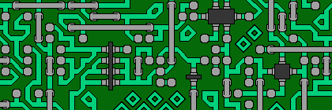

# Wave Function Collapse for Tilemap Generation
This is a Python implementation of the Wave Function Collapse algorithm. This implementation uses the algorithm to generate bitmaps.

### Table of Contents
➤ [Wave Function Collapse](#WFC)\
➤ [The Implementation](#code)\
➤ [References & Credits](#appendix)

## Wave Function Collapse
Remeber that puzzle where you tries to colour regions on a map such that no adjacent regions have the same colour? To solve the puzzle, one could start with randomly selecting a region to colour. Afterwards, one can try select regions with less possibilities of colours to colour next. And so on and so forth until every region has been coloured, satisfying the contraint. The WFC algorithm acts in the same way, with inspirations taken from the field of Quantum Mechanics [[1]](#wfc_github).

&nbsp;&nbsp;&nbsp;&nbsp;Starting with a grid of square tiles, the aim is to filled the grid with patterns such that some constraints between ajacent tiles must be satisfied. For example, let this grid be a map in an adventure game, and the patterns we can use to fill are squares of land, sea or beach. The constraints might be that sea tile must not be adjacent to land, beach tile must be above a sea tile, etc.\
&nbsp;&nbsp;&nbsp;&nbsp;At first, the algorithm randomly select a tile, then randomly select a pattern for that tile. After a tile's state has been determined, the tile is said to have **collapsed**. Once collapsed, we now have information on what the adjacent tiles can/cannot be.\
&nbsp;&nbsp;&nbsp;&nbsp;With that in mind, the algorithm now propogates this change to those adjacent tiles. However, since these tiles' possibilties have changed, the adjacent tiles to them might also change. So, the algorithm continues propogating the changes to more tiles until no more tiles change. The propogation can be thought of as dominoes falling down, trickling other dominoes until no more falls down.\
&nbsp;&nbsp;&nbsp;&nbsp;After the propogation has died down, the algorithm once again select a tile to collapse. But this time, it chooses the tile based on **entropy**, that is selecting the tiles with the lowest entropy to collapse. You can think of this as selecting tiles that have the fewest numbers of valid patterns. After collapsing a tile, the process repeats. The algorithm propogates the changes, then collapsing another tile and so on. This is done until the grid has been filled up or the algorithm has encounter a tile that cannot be filled with any pattern.

For more information and better explanations, please check out these resources:
- [Blog](https://robertheaton.com/2018/12/17/wavefunction-collapse-algorithm/) explaining WFC wrote by Robert Heaton. This is also the repository's main reference.
- BorisTheBrave's explanation on [WFC](https://www.boristhebrave.com/2020/04/13/wave-function-collapse-explained/).
- Youtube videos on WFC: https://www.youtube.com/watch?v=2SuvO4Gi7uY or https://www.youtube.com/watch?v=qRtrj6Pua2A
- Iteractive webite for WFC: https://bolddunkley.itch.io/wfc-mixed

## The Implementation
The code for WFC algorithm is found in `wfc` package. The algorithm works with a pre-defined set of images called patterns. The bitmap generated needs to satisfy one default constraint: for any adjacent tiles, they must share the same border. In other words, two cells' touching sides must share the same sequence of color when read in the same direction.

For example, say our patterns are 3x3 bitmaps, pattern A has a left border of color sequence (white, red, white) when reading from top to bottom. Then, the cell that is to the **left** of pattern A must have the same color sequence on its **right** border when reading in the same direction, that is (white, red, white).

    

With no pre-defined sets, one can also use a bitmap image to generate a pattern set and their corresponding adjacency rules. This is done with the Overlapping Model [[2]](#OverlappingModel) concept. The set can be generated by using the `generate_patterns` function provided in `wfc/utils.py`.

Furthermore, say you want a custom adjcency ruleset. This can done by subclassing the TileImage class and define your own way of determining adjacency. For more information, check out `demo.ipynb` in `/src`.

---
---

### References
---
[1] Gumin, M. (2016). Wave Function Collapse Algorithm (Version 1.0) [Computer software]. https://github.com/mxgmn/WaveFunctionCollapse

[2] Heaton, Robert. (2018). The Wavefunction Collapse Algorithm explained very clearly. https://robertheaton.com/2018/12/17/wavefunction-collapse-algorithm/

[3] Sherratt, Stephen (2019). Procedural Generation with Wave Function Collapse. https://www.gridbugs.org/wave-function-collapse/

### Credits
---
The Circuit and Knots tilesets, Cave and Flowers image in `/images` directory are taken from [mxgmn/WaveFunctionCollapse](https://github.com/mxgmn/WaveFunctionCollapse).